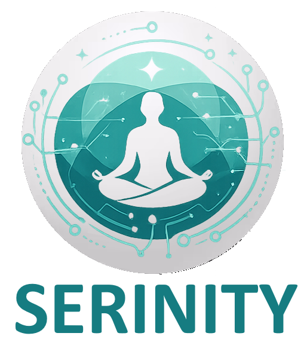

<!-- PROJECT SHIELDS -->

[](https://github.com/ZouariOmar/AgriGO/graphs/contributors)
[](https://github.com/ZouariOmar/AgriGO/network/members)
[](https://github.com/ZouariOmar/AgriGO/stargazers)
[](https://github.com/ZouariOmar/AgriGO/issues)
[](LICENSE)

<!-- PROJECT HEADER -->
<div align="center">
  <br />
  <a href="https://github.com/zouari-oss/serinity">
    
  </a>
  <h6>A desktop & web application dedicated to psychotherapy and personal development</h6>
  <br />
  <br />
</div>

<!-- PROJECT LINKS -->
<p align="center">
  <a href="#overview">Overview</a> •
  <a href="#about-the-project">About the Project</a> •
  <a href="#key-features">Key Features</a> •
  <a href="#how-to-use">How to Use</a> •
  <a href="#download">Download</a> •
  <a href="#emailware">Emailware</a> •
  <a href="#license">License</a> •
  <a href="#contact">Contact</a>
</p>

<!-- PROJECT TAGS -->

<p align="center">
  
  
  
  
  
  
  
  
  
  
  
  
</p>

<p align="center">
  <a href="doc/" target="_blank">
    
  </a>
</p>

## Overview

Serinity is a **desktop & web application** dedicated to **psychotherapy and personal development**, designed for both **individual users** and **mental health professionals**.
The platform integrates **Artificial Intelligence** to provide personalized emotional analysis, recommendations, and professional therapeutic tools.

## About the Project

- **Theme:** Psychotherapy & Personal Development
- **Platforms:** Desktop & Web
- **Goal:** Improve mental well-being through intelligent tracking, analysis, and guidance
- **Approach:** Modular architecture with AI integration

## Key Features

### User Management

- Authentication & authorization
- Role-based access (Client, Therapist, Admin)
- Secure sessions & audit logs

### Sleep Tracking

- Sleep cycle analysis
- Dream logging & emotional impact

### Mood & Journal

- Daily mood tracking
- Guided emotional questions
- Personal journal with NLP analysis

### Support Network (Forum)

- Community posts & comments
- Secure peer support environment

### Exercises & Resources

- Guided relaxation & meditation exercises
- Multimedia resources (audio, video, text)
- Favorites & progress tracking

### Appointments & Consultations

- Therapist availability management
- Online consultations
- Smart appointment recommendations

### Artificial Intelligence Integration

- Facial recognition for authentication
- NLP-based emotion detection from journals
- AI-assisted self-assessment
- Session summarization & topic extraction
- Intelligent appointment scheduling

## How to Use

### 1. Clone the Repository and Navigate to the Project

```bash
git clone https://github.com/zouari-oss/serinity-desktop
cd serinity-desktop/project
```

### 2. Compile the Project

Before compiling/running, install and configure Java OpenCV on your machine:

```bash
curl -fsSL https://raw.githubusercontent.com/zouari-oss/cpkg/main/scripts/java/opencv4j2.sh | bash
```

Reference scripts:

- <https://github.com/zouari-oss/cpkg/blob/main/scripts/java/opencv4j2.sh>
- <https://github.com/zouari-oss/cpkg/blob/main/scripts/java/opencv4j2.ps1>

> [!IMPORTANT]
> After running the OpenCV setup script, copy the generated `opencv.jar` into:
> `project/access-control/lib/`

```bash
mvn compile
```

### 3. Run the Application

```bash
mvn -pl app javafx:run
```

### 4. Setup Database & Local AI Assets (required for local AI features)

From the `project/` directory:

```bash
./scripts/setup-project
```

This installs:

- MariaDB setup for SQL injection module: sets `root` password to `root`, creates `serinity` database, and imports all `project/sql/*.sql` files
- `Mistral-7B-Instruct-v0.3-Q4_K_M.gguf` into `servers/sleep-ai-local-server/`
- `antelopev2` ONNX models into `access-control/src/main/resources/antelopev2/`
- Python virtual environments for local servers in `servers/*/.venv` (from each `requirements.txt`)

Optional flags:

```bash
./scripts/setup-project --force
./scripts/setup-project --skip-gguf
./scripts/setup-project --skip-antelope
./scripts/setup-project --skip-servers
./scripts/setup-project --skip-sql
```

> [!IMPORTANT]
> MariaDB must already be installed on your system (no auto-install in the script).
>
> `setup-project` needs `sudo` privileges for MariaDB service startup and root credential update.
>
> For SQL injection module setup, MariaDB root credentials are expected to be:
>
> - username: `root`
> - password: `root`
>
> Start local AI servers in separate terminal sessions, each on a different port, so the desktop app can interact with all services correctly at the same time.

### 5. Build Native/Desktop Artifacts

From the `project/` directory, use the deploy script:

```bash
./scripts/deploy-native --type all
```

> Supported `--type` values: `jar`, `native` (`app-image`), `deb`, `rpm` (`rmp`), `dmg`, `pkg`, `exe`, `msi`, `all`.

Useful examples:

```bash
./scripts/deploy-native --type jar
./scripts/deploy-native --type native,deb,rpm
PACKAGE_TYPES=all ./scripts/deploy-native
```

Build outputs:

- app-image: `app/target/native/serinity`
- jar/installers: `app/target/dist/`

> [!TIP]
> Make sure you have **Java JDK 25+** and **Maven** installed.
> If you encounter dependency issues, try:

```bash
mvn clean install
```

## Download

You can [download](https://github.com/zouari-oss/serinity-desktop/releases) the latest installable version of Serinity for Windows, macOS and Linux.

## Emailware

serinity is an emailware. Meaning, if you liked using this app or it has helped you in any way,
would like you send as an email at <zouariomar20@gmail.com> or <ghaithbensalah1999@gmail.com> about anything you'd want to say about
this software. I'd really appreciate it!

## License

This repository is licensed under the **GPL3.0 License**. You are free to use, modify, and distribute the content. See the [LICENSE](LICENSE) file for details.

## Contact

For questions or suggestions, feel free to reach out the [AUTHORS](AUTHORS)

**Happy Learning!**
