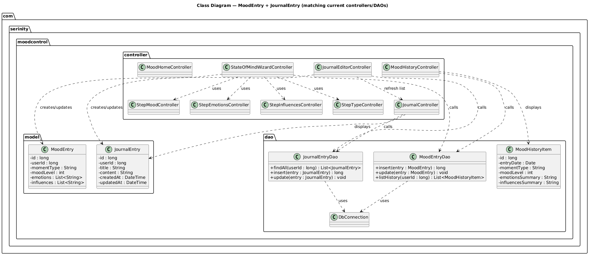
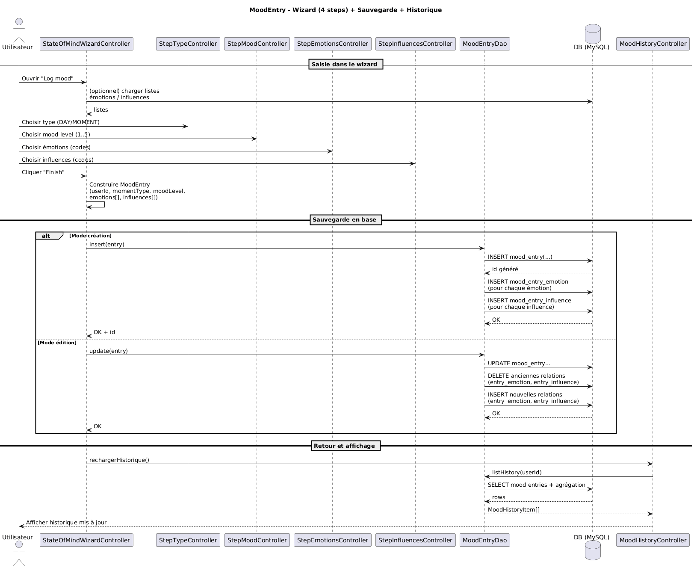
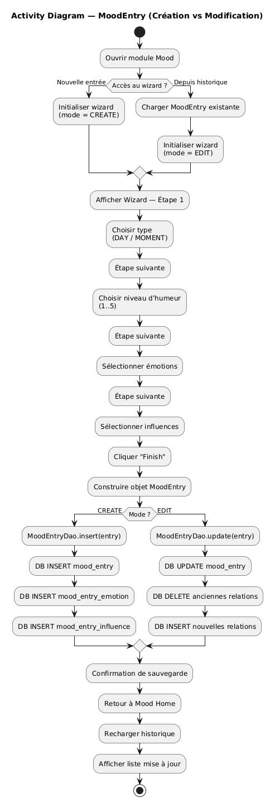
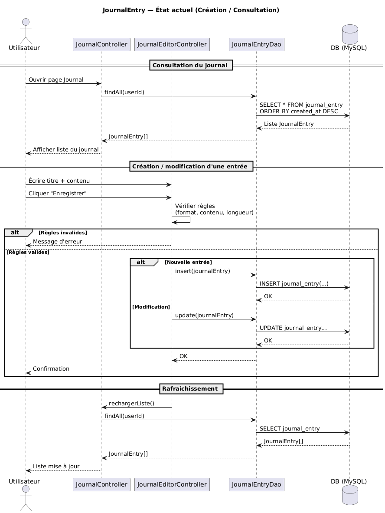
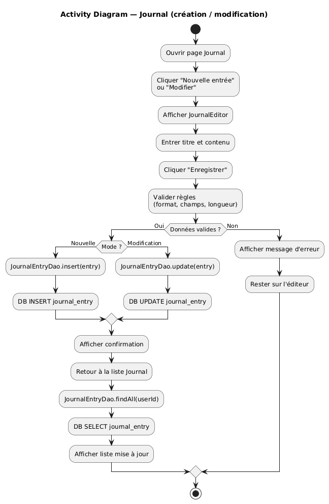
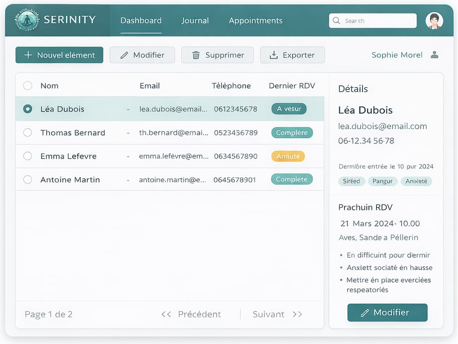
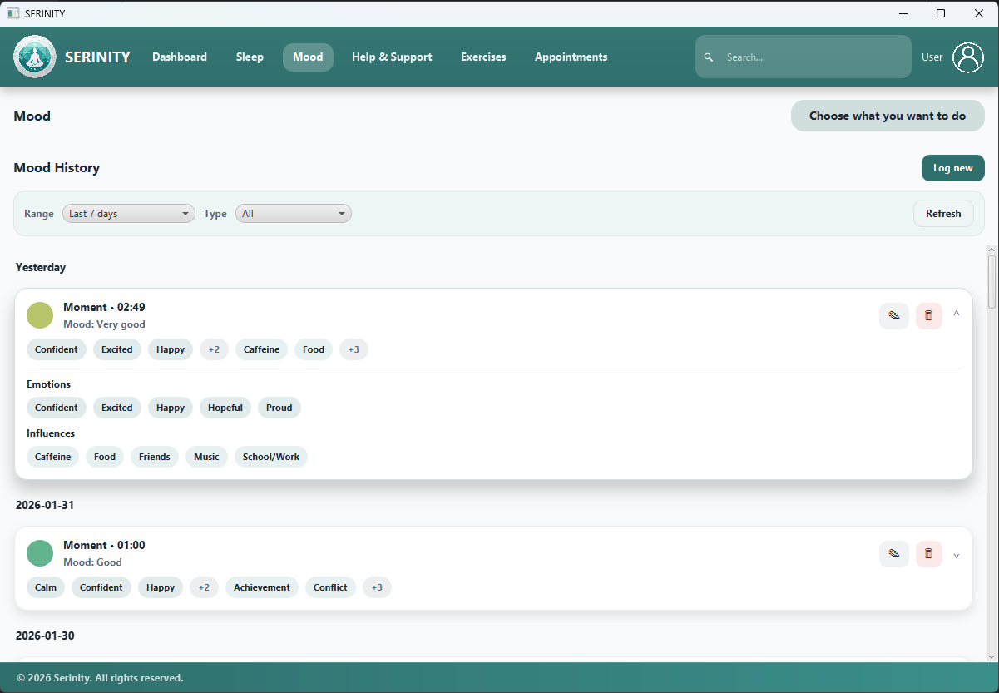
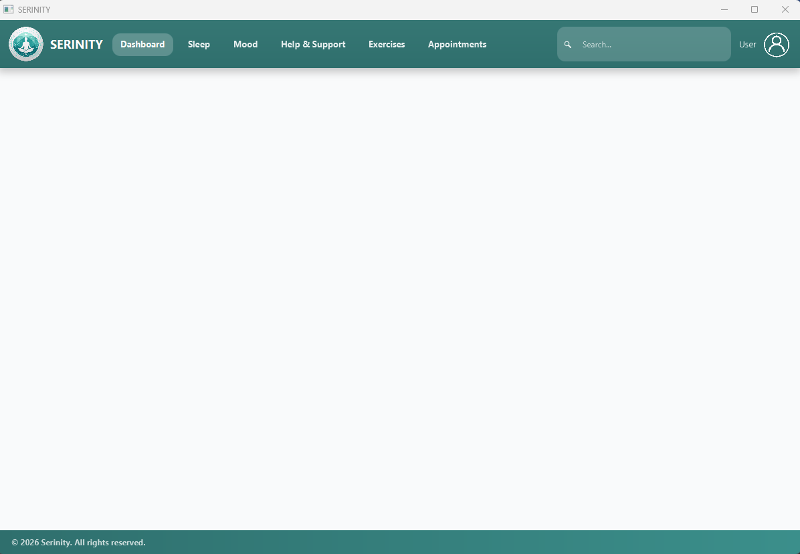
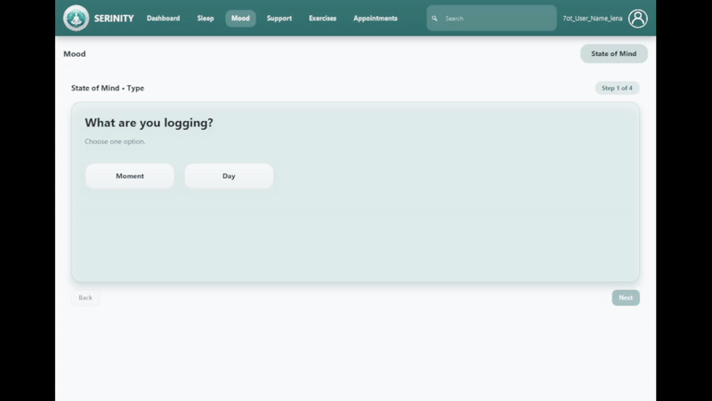
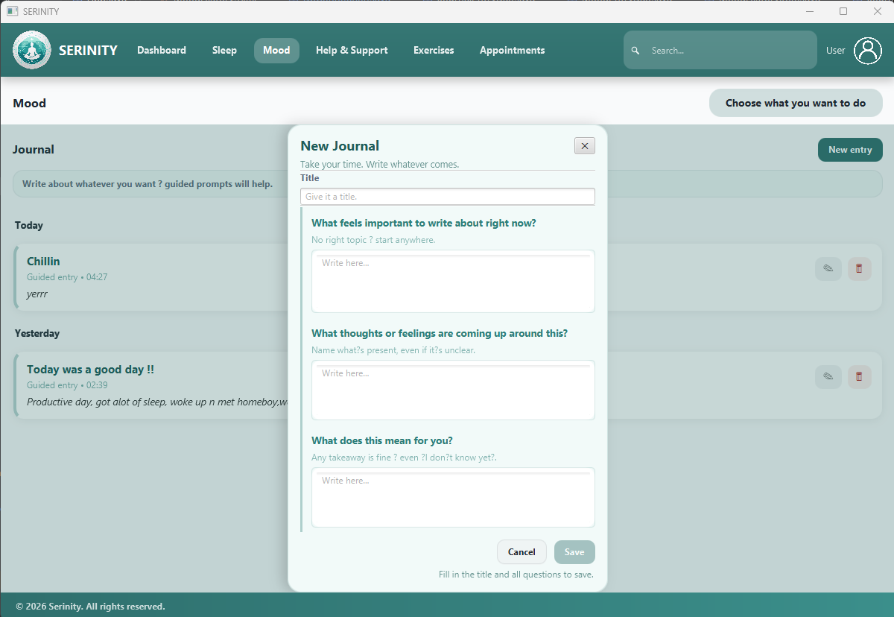

<!-- PROJECT HEADER -->

   
  
  <h6>A desktop & web application dedicated to psychotherapy and personal development</h6>
   
   

<!-- PROJECT LINKS -->

  <a href="#overview">Overview</a> •
  <a href="#about-the-project">About the Project</a> •
  <a href="#key-features">Key Features</a> •
  <a href="#how-to-use">How to Use</a> •
  <a href="#download">Download</a> •
  <a href="#emailware">Emailware</a> •
  <a href="#license">License</a> •
  <a href="#contact">Contact</a>

<!-- PROJECT TAGS -->

  
  
  
  
  
  
  
  
  
  
  
  

---
## 1️⃣ Présentation du module (Mood & Journal)

Le module **Mood & Journal** permet à l’utilisateur de :
- enregistrer son humeur via un wizard en plusieurs étapes (type, niveau, émotions, influences)
- consulter l’historique des humeurs
- créer et modifier des entrées de journal personnel

---
## 2️⃣ Analyse des besoins & choix des entités

### 2.1 Point de départ : les actions utilisateur
Au lieu de partir directement de la base de données, j’ai d’abord listé les actions réelles effectuées dans l’application :

- **Enregistrer une humeur** (wizard)
- **Consulter l’historique des humeurs**
- **Créer / modifier une entrée de journal**
- **Consulter le journal**

L’objectif était d’identifier ce qui doit être **persistant**, **retrouvable** et **réutilisable** dans le temps.

---

### 2.2 Entités principales (données métier persistantes)

#### ✅ MoodEntry
Représente un enregistrement d’humeur à un instant donné.
- possède une identité (`id`)
- appartient à un utilisateur (`userId`)
- contient les données métier de l’humeur :
  - type de moment (DAY / MOMENT)
  - niveau d’humeur (1..5)
  - émotions sélectionnées
  - influences sélectionnées
- est affichée dans l’historique et peut être modifiée

➡️ `MoodEntry` est donc une entité centrale du module.

#### ✅ JournalEntry
Représente une entrée de journal personnel.
- possède une identité (`id`)
- appartient à un utilisateur (`userId`)
- contient un **contenu textuel** (et éventuellement un titre)
- a son propre cycle de vie : création, modification, consultation

➡️ `JournalEntry` est une entité à part entière, car elle n’est pas juste un champ dans MoodEntry : elle a son propre écran, ses règles et ses tests.

---

### 2.3 Données de référence (vocabulaire contrôlé)

#### ✅ Emotion / Influence
Les émotions et influences sont modélisées comme des données de référence, car :
- une même émotion peut être utilisée dans plusieurs enregistrements d’humeur
- une même influence peut revenir souvent
- on veut éviter les doublons et incohérences (ex: “stress”, “Stress”, “stressed”)
- on veut pouvoir filtrer et requêter proprement

➡️ Elles sont donc séparées en tables dédiées et reliées aux humeurs via des relations.

---

### 2.4 Relations et normalisation (raisonnement)
- **MoodEntry ↔ Emotion** : plusieurs-à-plusieurs  
  → une humeur peut avoir plusieurs émotions, et une émotion peut apparaître dans plusieurs humeurs
- **MoodEntry ↔ Influence** : plusieurs-à-plusieurs  
  → même logique

➡️ Cela justifie l’usage de tables de jointure (relationnelles) plutôt que de stocker des listes en texte.

---

### 2.5 Pourquoi 0 héritage (0 “extends”)
Aucun héritage n’a été introduit car il n’existe pas de relation métier “est-un” :
- `MoodEntry` n’est pas un `JournalEntry`
- `JournalEntry` n’est pas une spécialisation de `MoodEntry`

Les similitudes éventuelles (id, userId, dates) sont **techniques**, pas métier.
➡️ On a donc privilégié une conception simple, claire et cohérente avec l’implémentation réelle.

---
## 3️⃣ Modèle de données (DB) — connexions, codes (clé/valeur) et sécurité

### 3.1 Connexion DB via `.env.development` (Dotenv)
- La connexion est centralisée dans `DbConnection`.
- Les credentials ne sont pas codés en dur : ils sont chargés depuis un fichier **.env de développement** :
  - dossier : `mood-control`
  - fichier : `.env.development`
- Variables utilisées :
  - `DATABASE_URL`
  - `DATABASE_USERNAME`
  - `DATABASE_PASSWORD`
- La connexion est obtenue via `DriverManager.getConnection(URL, USER, PASS)`.

✅ Avantages :
- séparation config / code
- facile à changer selon environnement (dev/test)
- évite de push des secrets sur Git

---

### 3.2 “Codes” côté UI (clé) vs affichage i18n (valeur)
Dans l’interface, les choix utilisateur (émotions, influences, filtres) sont manipulés sous forme de **codes stables** :
- Exemples : `CALM`, `AFRAID`, `SCHOOL_WORK`, `SOCIAL_MEDIA`, `DAY`, `MOMENT`

Ces codes jouent le rôle de **clé (key)** :
- stable (ne dépend pas de la langue)
- normalisé (trim + uppercase)
- transmissible facilement entre contrôleurs et DAO (`List<String>`)

L’affichage utilisateur (la **valeur / label**) vient de l’i18n (`messages.properties`, `messages_fr.properties`, etc.).
➡️ Donc : **on stocke / transporte des codes**, et **on affiche des traductions**.

✅ Avantages :
- aucune donnée métier dépendante du français/anglais/arabe
- l’historique reste cohérent même si on change les textes UI
- facilite le filtrage et les requêtes

---

### 3.3 Flux Controller → DAO (Mood)
- Le wizard construit un `MoodEntry` contenant :
  - `momentType` (code : `DAY` / `MOMENT`)
  - `moodLevel` (1..5)
  - `emotions` (List de codes)
  - `influences` (List de codes)
- Le DAO (`MoodEntryDao`) persiste :
  1) insertion dans `mood_entry`
  2) résolution des IDs d’émotions/influences à partir des **codes**
  3) insertion dans les tables de jointure (`mood_entry_emotion`, `mood_entry_influence`)

---

### 3.4 Résolution “codes → IDs” (normalisation)
Pour relier MoodEntry aux tables de référence :
- `idsByCodes(cn, "emotion", entry.getEmotions())`
  - correspondance via `UPPER(name)` (ex: "Calm" → `CALM`)
- `idsByCodes(cn, "influence", entry.getInfluences())`
  - correspondance via `UPPER(REPLACE(REPLACE(name,'/','_'),' ','_'))`
  - ex: "School/Work" → `SCHOOL_WORK`

➡️ Le système accepte donc des codes UI normalisés et les mappe aux IDs DB.

---

### 3.5 Transactions (cohérence des écritures Mood)
Dans `MoodEntryDao.save()` et `MoodEntryDao.update()` :
- `cn.setAutoCommit(false)`
- insertion / update du `mood_entry`
- gestion des relations (insert + batch / delete + insert)
- `cn.commit()` en succès
- `cn.rollback()` en cas d’erreur

✅ Avantages :
- aucune humeur “à moitié enregistrée”
- DB toujours cohérente (entrée + relations)

---

### 3.6 Sécurité : protection contre SQL Injection
Les requêtes utilisent **PreparedStatement** partout, avec paramètres (`?`) :
- `JournalEntryDao` :
  - `WHERE user_id=?`
  - `WHERE id=? AND user_id=?`
  - `INSERT ... VALUES(?,?,?)`
  - `UPDATE ... WHERE id=? AND user_id=?`
  - `DELETE ... WHERE id=? AND user_id=?`
- `MoodEntryDao` :
  - insert/update/delete avec paramètres
  - filtrage `lastDays` et `typeFilter` via paramètres
  - `IN (?, ?, ?, ...)` généré proprement + valeurs injectées via `ps.setX()`

➡️ Résultat : l’utilisateur ne peut pas injecter du SQL via le contenu journal ou les filtres,
car les valeurs sont **liées** (bind) et non concaténées dans la requête.

⚠️ Note : les seuls morceaux concaténés sont des noms de tables/colonnes internes (`emotion`, `influence`, join tables),
qui ne proviennent pas de l’utilisateur (donc pas un vecteur d’injection).

---

### 3.7 Scoping par utilisateur (isolation des données)
Toutes les opérations sensibles sur le journal sont “scopées” :
- lecture par user : `WHERE user_id=?`
- update/delete : `WHERE id=? AND user_id=?`

✅ Avantage :
- empêche de modifier/supprimer les entrées d’un autre utilisateur (même si l’ID est connu).

---

## 4️⃣ Architecture et structure (organisation du module)

### 4.1 Vue globale
Le module `mood-control` est structuré de manière MVC (JavaFX) avec une séparation claire :
- **Model** : objets métier persistants
- **Controller** : logique UI et navigation
- **DAO** : accès aux données (JDBC)
- **Resources** : FXML, styles, assets, i18n
- **Tests** : validation DB, i18n et règles métier (journal)

---

### 4.2 Organisation des packages (src/main/java)
#### `com.serinity.moodcontrol`
- `App.java` : point d’entrée du module
- `SystemInfo.java` : informations système (diagnostic)

#### `controller/` (logique UI JavaFX)
- **Template / navigation**
  - `MainTemplateController.java` (layout partagé)
- **Mood**
  - `MoodHomeController.java`
  - `StateOfMindWizardController.java`
  - `MoodHistoryController.java`
  - Steps :
    - `StepTypeController.java`
    - `StepMoodController.java`
    - `StepEmotionsController.java`
    - `StepInfluencesController.java`
- **Journal**
  - `JournalController.java` (liste/consultation)
  - `JournalEditorController.java` (création/modification)

➡️ Les contrôleurs orchestrent l’UI et délèguent la persistance aux DAOs.

#### `dao/` (persistance JDBC)
- `DbConnection.java` : connexion DB via `.env.development`
- `MoodEntryDao.java` : save/update/delete + historique mood (transactions + tables de jointure)
- `JournalEntryDao.java` : CRUD journal (requêtes préparées)
- `MoodHistoryItem.java` : modèle d’affichage (DTO) utilisé dans l’historique

#### `model/` (entités métier)
- `MoodEntry.java`
- `JournalEntry.java`

#### `service/`
- dossier présent (prévu pour une future couche service), mais non utilisé dans la version actuelle.

---

### 4.3 Ressources (src/main/resources)
#### FXML
- `fxml/Template.fxml` : squelette principal (layout partagé)
- `fxml/mood/`
  - `MoodHome.fxml`
  - `Wizard.fxml`
  - `MoodHistory.fxml`
  - `Journal.fxml`
  - `JournalEditor.fxml`
- `fxml/mood/steps/` : les 4 étapes du wizard
  - `StepType.fxml`
  - `StepMood.fxml`
  - `StepEmotions.fxml`
  - `StepInfluences.fxml`
- `fxml/pages/Blank.fxml` : page placeholder

#### Styles et assets
- `styles/styles.css`
- `assets/` + `assets/icons/` (logos + icônes mood)

#### Internationalisation
- `i18n/messages.properties` (EN)
- `i18n/messages_fr.properties`

---

### 4.4 Tests (src/test/java)
- `MainTest.java` : test de démarrage / sanity
- `DbDumpTest.java` : visibilité DB / debug contenu
- `I18nTest.java` : vérification chargement des traductions
- `JournalEditorRulesTest.java` : règles/validation journal
- `JournalFormatTest.java` : format/parsing journal

➡️ Les tests couvrent à la fois l’infrastructure (DB, i18n) et des règles métier (journal).

---

## 5️⃣ Fonctionnalité Mood — Wizard & Historique

### 5.1 Objectif fonctionnel
La fonctionnalité Mood permet à l’utilisateur de :
- enregistrer une humeur via un wizard guidé
- consulter l’historique des humeurs
- modifier ou supprimer une humeur existante

Cette fonctionnalité est conçue pour garantir :
- une saisie progressive et claire
- des données cohérentes et normalisées
- une mise à jour immédiate de l’historique

---

### 5.2 Wizard Mood (State of Mind) — découpage en étapes
L’enregistrement d’une humeur se fait via un **wizard en plusieurs étapes**, orchestré par  
`StateOfMindWizardController`.

Les étapes sont :
1. **Type de moment** (valeur métier stockée en base)
2. **Niveau d’humeur** (échelle numérique)
3. **Émotions** (liste de codes)
4. **Influences** (liste de codes)

Chaque étape est gérée par un *Step Controller* dédié :
- `StepTypeController`
- `StepMoodController`
- `StepEmotionsController`
- `StepInfluencesController`

➡️ Les Step Controllers ne communiquent pas avec la base de données ;  
ils collectent uniquement les choix utilisateur.

---

### 5.3 Mode CREATE vs EDIT (déterminé à l’ouverture)
Le wizard peut être ouvert dans deux contextes distincts :

- **CREATE**
  - accès depuis `MoodHome`
  - aucune donnée préexistante
  - sauvegarde via `MoodEntryDao.save(entry)`

- **EDIT**
  - accès depuis `MoodHistory`
  - chargement des données existantes via  
    `MoodEntryDao.findById(moodEntryId, userId)`
  - champs et sélections pré-remplis
  - sauvegarde via `MoodEntryDao.update(entry)`

👉 Le mode est déterminé **avant l’affichage de la première étape**.  
Les étapes du wizard restent identiques ; seule la phase de persistance change.

---

### 5.4 Gestion des codes (momentType, émotions, influences)
Le module manipule des **codes métier stables**, indépendants de la langue d’affichage :

- `momentType` : valeur métier stockée en base
- émotions : `List<String>` de codes
- influences : `List<String>` de codes

Ces codes :
- sont transmis du contrôleur vers le DAO
- sont normalisés côté DAO (`trim`, `uppercase`)
- ne dépendent jamais des textes affichés à l’utilisateur

➡️ L’internationalisation (i18n) est utilisée uniquement pour l’affichage UI.

---

### 5.5 Sauvegarde Mood (transactions et normalisation)
#### Création (`save`)
Lors d’une création :
- insertion dans la table `mood_entry`
- récupération de l’identifiant généré
- conversion des codes en IDs de référence
- insertion dans les tables de jointure :
  - `mood_entry_emotion`
  - `mood_entry_influence`
- validation via transaction (`commit` / `rollback`)

#### Modification (`update`)
Lors d’une modification :
- mise à jour de la ligne `mood_entry`
- suppression des relations existantes
- ré-insertion des relations basées sur les nouveaux codes
- validation transactionnelle

➡️ Ces opérations sont **atomiques** : aucune donnée partielle n’est persistée.

---

### 5.6 Historique des humeurs (MoodHistory)
L’écran d’historique est géré par `MoodHistoryController`.

- Les données sont récupérées via  
  `MoodEntryDao.findHistory(userId, lastDays, typeFilter)`
- Le DAO retourne une liste de `MoodHistoryItem`

`MoodHistoryItem` est un **DTO d’affichage** :
- il ne représente pas une entité métier
- il regroupe uniquement les informations nécessaires à l’UI
- il contient des **codes** (émotions et influences), pas des labels traduits

Les émotions et influences sont enrichies via :
- `fillEmotions(...)`
- `fillInfluences(...)`

➡️ Les codes retournés sont ensuite traduits côté interface.

---

### 5.7 Filtrage et cohérence des données
L’historique supporte :
- filtrage temporel (`lastDays`)
- filtrage par type (`typeFilter` basé sur codes)

Toutes les requêtes sont :
- paramétrées (`PreparedStatement`)
- scopées par utilisateur (`user_id`)

---

### 5.8 Suppression d’une humeur
La suppression est réalisée via  
`MoodEntryDao.delete(moodEntryId, userId)` :

- suppression des relations dans les tables de jointure
- suppression de la ligne `mood_entry`
- transaction sécurisée

➡️ Le scoping par `user_id` empêche toute action sur les données d’un autre utilisateur.

---

### 5.9 Retour et rafraîchissement de l’UI
Après une création, modification ou suppression :
- l’utilisateur est redirigé vers l’écran Mood
- l’historique est rechargé depuis la base
- les changements sont visibles immédiatement

---

### 5.10 Résumé
- Saisie guidée via wizard
- Mode CREATE / EDIT clair et déterminé dès l’entrée
- Utilisation de codes métier stables
- Persistance transactionnelle
- Historique cohérent et filtrable

---
## 6️⃣ Fonctionnalité Journal

### 6.1 Objectif fonctionnel
La fonctionnalité Journal permet à l’utilisateur de :
- consulter ses entrées de journal personnel
- créer une nouvelle entrée
- modifier ou supprimer une entrée existante

Le journal est conçu comme un espace libre d’expression, distinct de l’enregistrement d’humeur, tout en restant intégré au même module.

---

### 6.2 Consultation du journal
L’écran Journal est géré par `JournalController`.

- Les entrées sont chargées depuis la base via  
  `JournalEntryDao.findAll(userId)`
- Les entrées sont affichées par ordre chronologique décroissant
- Chaque entrée peut être ouverte pour consultation ou modification

➡️ Le contrôleur se limite à la logique d’affichage et délègue l’accès aux données au DAO.

---

### 6.3 Création et modification d’une entrée
La création et l’édition sont gérées par `JournalEditorController`.

Deux modes sont possibles :
- **CREATE** : nouvelle entrée de journal
- **EDIT** : modification d’une entrée existante

Le mode est déterminé à l’ouverture de l’éditeur :
- en CREATE, un nouvel objet `JournalEntry` est initialisé
- en EDIT, l’entrée existante est chargée depuis la base

---

### 6.4 Validation et persistance
Avant la sauvegarde :
- le contenu est validé côté contrôleur (format, règles métier)

La persistance est assurée par `JournalEntryDao` :
- `insert(entry)` pour une création
- `update(entry)` pour une modification
- `delete(id, userId)` pour une suppression

Toutes les opérations sont :
- réalisées via des requêtes préparées
- scopées par utilisateur (`user_id`)
- indépendantes de la langue d’affichage

---

### 6.5 Séparation Journal / Mood
Dans l’état actuel du projet :
- une entrée de journal est **indépendante** d’une entrée d’humeur
- aucune relation directe n’est imposée en base de données

Ce choix permet :
- une utilisation libre du journal
- une évolution future sans contrainte structurelle

---

### 6.6 Ouverture vers une intégration IA (référence)
Le journal est conçu comme un point d’extension naturel pour des fonctionnalités avancées.

À terme, il est prévu d’intégrer :
- une analyse automatique du contenu textuel
- un tagging sémantique (émotions, thèmes, tendances)
- une exploitation de ces données pour enrichir le suivi émotionnel

➡️ Ces évolutions sont détaillées dans la section **1️⃣1️⃣ Améliorations futures**.

---

## 7️⃣ Internationalisation (i18n) — étape par étape

### Étape 1 — Choix de la langue au démarrage
La langue de l’application est déterminée **au démarrage**, dans `App.java`.

- Le `Locale` est basé sur la langue du système

Ce choix est centralisé et appliqué à toute l’interface.

---

### Étape 2 — Chargement du ResourceBundle
Une fois le `Locale` défini, l’application charge le bundle correspondant :

- `messages.properties` (par défaut)
- `messages_fr.properties`

Le fichier utilisé dépend automatiquement de la langue choisie.

---

### Étape 3 — Injection du bundle dans les FXML
Le `ResourceBundle` est transmis au `FXMLLoader` lors du chargement de l’interface principale (`Template.fxml`).

- Toutes les vues chargées à partir de ce point partagent le même bundle
- Les clés `%key` utilisées dans les FXML sont résolues automatiquement

---

### Étape 4 — Accès au bundle dans les contrôleurs
Les contrôleurs JavaFX reçoivent automatiquement le `ResourceBundle` utilisé par le FXML.

- Le bundle est injecté via `@FXML ResourceBundle resources`
- Les contrôleurs **ne chargent pas eux-mêmes** les traductions
- Ils utilisent uniquement les clés définies

---

### Étape 5 — Séparation données / affichage
- Les données métier (codes, types, valeurs stockées en base) sont **indépendantes de la langue**
- L’i18n concerne uniquement les libellés affichés à l’utilisateur
- Le changement de langue n’impacte ni la base de données ni la logique métier

---

### Étape 7 — Vérification par tests
Un test dédié (`I18nTest`) permet de vérifier :
- le chargement correct des fichiers de traduction
- la disponibilité des clés principales
- la stabilité de l’application en cas de langue différente
---

## 8️⃣ Tests & vérifications — étape par étape

### Étape 1 — Vérifier le démarrage du module
- Ajout d’un test de base (`MainTest`) pour s’assurer que le module démarre correctement et que l’environnement d’exécution est valide.

---

### Étape 2 — Vérifier la base de données et son contenu
- Ajout d’un test (`DbDumpTest`) pour confirmer :
  - que la connexion DB fonctionne via `DbConnection`
  - que les tables attendues sont accessibles
  - que les données (références / entrées) sont visibles
- Objectif : diagnostiquer rapidement les problèmes de configuration DB pendant le développement.

---

### Étape 3 — Vérifier l’internationalisation
- Ajout d’un test (`I18nTest`) pour valider :
  - le chargement des `ResourceBundle`
  - la disponibilité des clés essentielles
  - la stabilité du système avec différentes langues

---

### Étape 4 — Tester les règles du Journal
- Ajout de tests dédiés au journal :
  - `JournalEditorRulesTest` : validation des règles (contraintes, logique)
  - `JournalFormatTest` : format/parsing/validation de contenu (selon les règles définies)
- Objectif : éviter que des entrées invalides passent en base et garantir un comportement stable.

---

### Étape 5 — Vérification continue
- Les tests sont exécutés régulièrement via Maven (`mvn test`) pour détecter rapidement :
  - les régressions
  - les erreurs de configuration
  - les incohérences DB/i18n
---

## 9️⃣ Diagrammes UML — étape par étape

### Étape 1 — Diagramme de cas d’utilisation (Use Case)
Ce diagramme présente les interactions principales entre l’utilisateur et le module Mood & Journal.

- Gestion des humeurs (Mood)
- Gestion du journal personnel
- Représentation conceptuelle de l’acteur IA (analyse future du journal)

---

### Étape 2 — Diagramme de classes
Le diagramme de classes représente la structure statique du module :

- Entités métier : `MoodEntry`, `JournalEntry`
- Accès aux données : `MoodEntryDao`, `JournalEntryDao`, `DbConnection`
- Contrôleurs JavaFX
- DTO d’affichage : `MoodHistoryItem`
- Aucun héritage utilisé (choix volontaire)

---

### Étape 3 — Diagrammes de séquence (Mood)
Ces diagrammes illustrent le déroulement dynamique des fonctionnalités Mood.

#### Séquence — Enregistrement d’une humeur

#### Séquence — Consultation de l’historique Mood

---

### Étape 4 — Diagrammes de séquence (Journal)
Ces diagrammes décrivent les interactions pour le module Journal.

#### Séquence — Journal (état actuel)

#### Séquence — Journal avec extension IA (concept)

---

### Étape 5 — Diagrammes d’activités
Les diagrammes d’activités décrivent les flux fonctionnels globaux.

#### Activité — Mood

#### Activité — Journal

---
## 🔟 UI Design 🎨 — Mood & Journal Module

L’interface du module Mood & Journal a été conçue pour être cohérente, progressive et adaptée à un contexte de bien-être. Les choix d’interface visent à faciliter la saisie, la lecture et la réflexion, tout en restant simples à utiliser.

---

### 10.1 Évolution du design
Avant l’implémentation finale, une première version de l’interface a été conçue afin de valider la structure générale et les principaux composants visuels.  
Cette étape a permis d’itérer vers une interface plus claire et mieux structurée.

**Première itération :**  

**Design actuel :**  

---

### 10.2 Structure globale et template
L’application repose sur un **template commun** utilisé par l’ensemble des pages du module.  
Ce template garantit :
- une navigation cohérente,
- une identité visuelle uniforme,
- une séparation claire entre structure globale et contenu.

---

### 10.3 Identité visuelle et palette
Une palette de couleurs dédiée a été définie afin de maintenir une cohérence visuelle entre les différentes vues (Mood, History, Journal).  
Les couleurs sont utilisées pour :
- différencier les niveaux d’humeur,
- hiérarchiser l’information,
- conserver une atmosphère calme et lisible.

---

### 10.4 Interface Mood — Wizard et cartes
La saisie de l’humeur se fait via un **wizard étape par étape**, permettant à l’utilisateur de se concentrer sur une seule décision à la fois (type, niveau, émotions, influences).

L’historique des humeurs est affiché sous forme de **cartes**, plus adaptées à des données émotionnelles qu’un tableau classique.  
Les cartes sont **générées dynamiquement** à partir des données en base, ce qui permet de gérer :
- un nombre variable d’entrées,
- des contenus de longueur différente,
- des interactions (édition, suppression, détails).

**Interface en action :**  

---

### 10.5 Journal — continuité visuelle
Le module Journal reprend les mêmes principes visuels (cartes, lisibilité, actions par entrée) afin d’assurer une continuité d’expérience avec le module Mood, tout en restant adapté à l’écriture libre et réflexive.

---

### 10.6 Synthèse des choix UI
- Utilisation d’un template commun pour la cohérence
- Wizard pour réduire la charge cognitive
- Affichage par cartes pour des données personnelles et qualitatives
- Génération dynamique de l’interface à partir des données réelles
- Identité visuelle cohérente sur l’ensemble du module

---
## 1️⃣1️⃣ AI Assistance — Journal Analysis (Research & Design)

### Objectif
Cette partie présente la réflexion et la conception d’un **système d’assistance par IA** destiné à analyser les entrées de journal et à proposer des **tags émotionnels**.  
L’objectif n’est **pas diagnostique**, mais d’aider à la structuration et à la compréhension des écrits personnels.

---

### 1️ Pourquoi WEKA a été choisi

WEKA (Waikato Environment for Knowledge Analysis) a été retenu pour les raisons suivantes :

- Framework **open-source** et **basé sur Java**, compatible avec une application JavaFX
- Support natif du **traitement de texte (NLP)** et des algorithmes de Machine Learning supervisé
- Outils intégrés pour :
  - la vectorisation de texte (TF-IDF)
  - la classification (K-Nearest Neighbors)
- Largement utilisé dans le **contexte académique**
- Modèles **légers, interprétables et transparents**
- Fonctionnement local, sans dépendance à des services cloud ou GPU

Contrairement aux grands modèles de langage (LLM), WEKA permet de concevoir un système **contrôlable, explicable et adapté à un contexte sensible comme la santé mentale**.

---

### 2️ Nature du système d’IA proposé
Le système envisagé est :

- **Assisté par NLP**
- **Basé sur le Machine Learning supervisé**
- **Orienté aide à la décision**, et non diagnostic médical

Il analyse le texte du journal afin de **suggérer des tags émotionnels** (ex. anxiété, tristesse, colère), qui peuvent ensuite être validés ou modifiés par l’utilisateur ou un professionnel.

---

### 3️ Concepts techniques utilisés

#### 🔹 NLP (Natural Language Processing)
Utilisé pour transformer le texte libre du journal en une représentation exploitable par un algorithme.

#### 🔹 TF-IDF (Term Frequency – Inverse Document Frequency)
- Méthode de pondération des mots
- Transforme un texte en vecteur numérique
- Met en avant les termes importants d’un document par rapport à l’ensemble du corpus
- Ne constitue pas une IA à elle seule (pas d’apprentissage)

#### 🔹 K-Nearest Neighbors (KNN)
- Algorithme de Machine Learning supervisé
- Classe un nouveau texte en le comparant aux **K exemples les plus similaires**
- La classe majoritaire parmi les voisins est choisie
- Simple, interprtable et adapté à de petits jeux de données

#### 🔹 Pipeline IA
L’association **TF-IDF + KNN** forme un pipeline complet de classification de texte :
> Extraction de caractéristiques → comparaison → prédiction

---

### 4️ Format des données : ARFF
WEKA utilise le format **ARFF (Attribute-Relation File Format)** pour définir les jeux de données.

Ce format permet :
- de décrire les attributs (texte, labels)
- d’assurer la compatibilité avec les filtres et classifieurs WEKA
- de maintenir une structure de données claire et reproductible

Chaque instance correspond à une entrée de journal déjà annotée.

---

### 5️ Étapes conceptuelles d’implémentation

1. **Préparation du dataset**
   - Entrées de journal annotées avec un ou plusieurs tags
   - Définition d’un attribut texte et d’attribut(s) de classe

2. **Chargement des données**
   - Lecture du dataset ARFF dans WEKA (`Instances`)

3. **Vectorisation NLP**
   - Application du filtre `StringToWordVector`
   - Activation de TF-IDF et suppression des mots vides

4. **Classification**
   - Utilisation de `IBk` (KNN)
   - Choix de la valeur de K et de la métrique de distance

5. **Entraînement**
   - Stockage des vecteurs TF-IDF annotés
   - Aucun entraînement lourd ou réseau neuronal

6. **Prédiction**
   - Transformation du nouveau texte avec le même filtre
   - Comparaison aux exemples existants
   - Suggestion de tags par similarité

7. **Évaluation**
   - Validation croisée
   - Mesures : précision, rappel, F1-score

---

### 6 Justification dans un contexte de santé mentale
Cette approche est adaptée car elle est :

- **Interprétable** : les décisions reposent sur des similarités explicables
- **Légère** : faible consommation de ressources
- **Éthique** : aucune automatisation diagnostique
- **Encadrée** : suggestions modifiables par l’humain
- **Locale** : respect de la confidentialité des données

---

### 7 Conclusion
L’intégration de WEKA permet de mettre en place un **système d’assistance intelligent** basé sur la classification de texte, tout en restant compatible avec une application desktop Java.  
L’utilisation conjointe de TF-IDF et de KNN offre une solution **simple, académique et justifiable**, adaptée à l’analyse de journaux personnels dans un cadre de bien-être et de soutien psychologique.

---